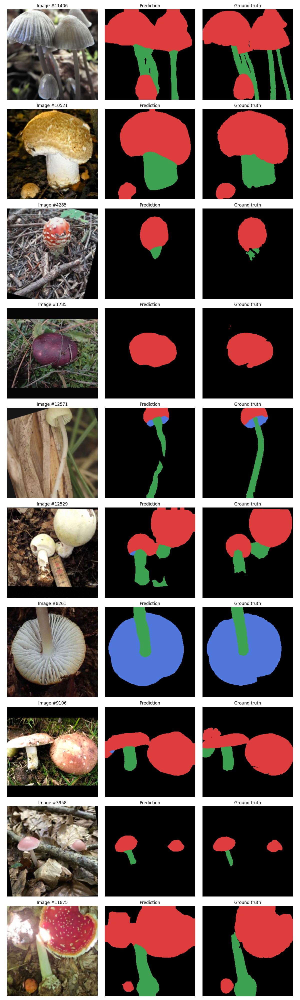

# FungiTastic Playground

This is a project for `Neural Network - Theory and Practice` course at the University of Wroclaw.

Dataset: https://bohemianvra.github.io/FungiTastic/

Goal: Fungi Segmentation

### Instalation

Install `uv` from https://docs.astral.sh/uv/.

```bash
uv sync
```

### Dataset download

```bash
mkdir data
uv run scripts/download.py --subset m --metadata --masks --images --size 300 --save_path ./data
uv run scripts/prepare_dataset.py
```

The compaction step creates one compressed segmentation file per split in
`data/FungiTastic/SegmentationDataset/`. Training loads
those files instead of the original mask parquet files.

### Running

```bash
uv run python -m scripts.train_model src/config/encdecnet_segmenter.py
```

### Results

